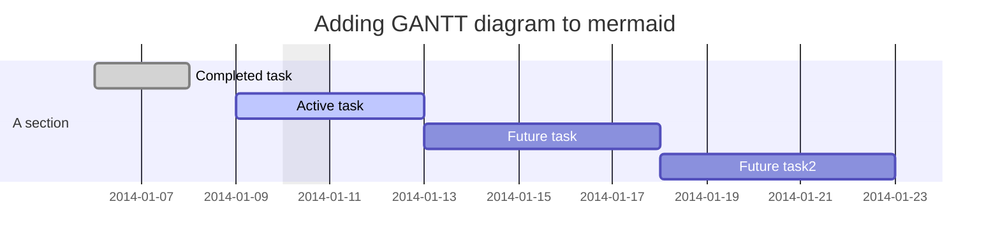
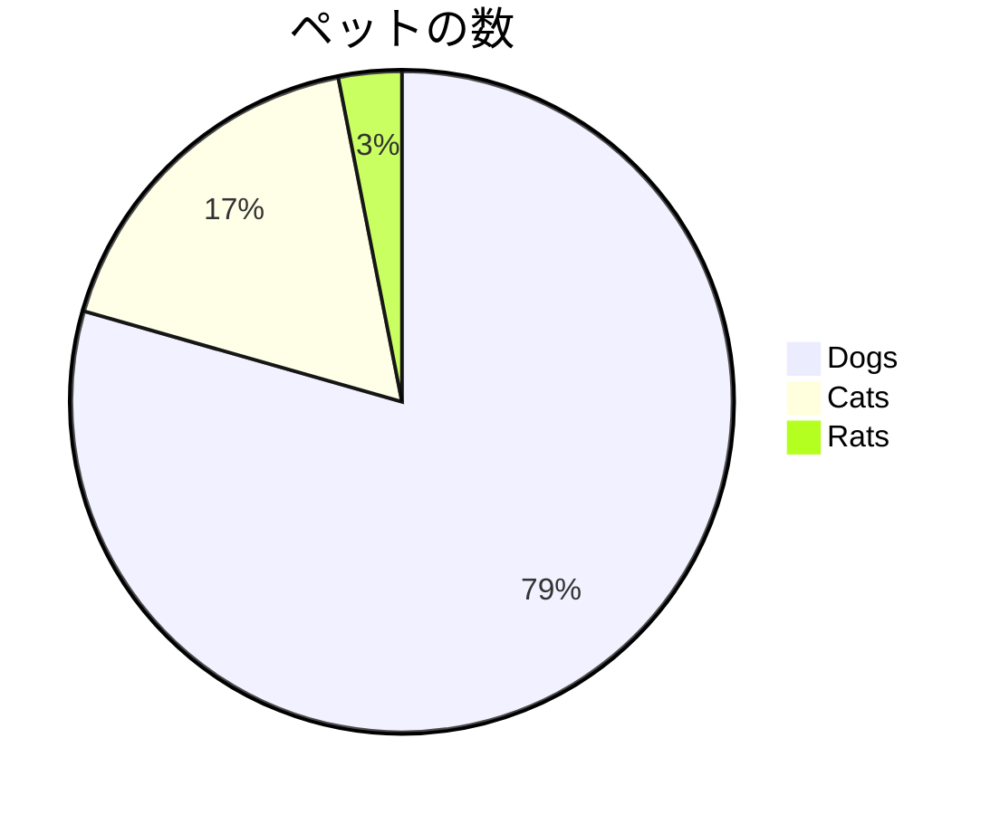
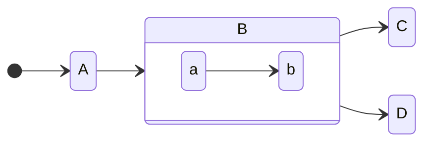

# Slidev入門


---
layout: intro
---

## 自己紹介

<div class="flex">
  <div class="basis-1/3">
    
    <div class="py-3 text-4xl text-center font-bold">片田恭平</div>
    <div class="flex justify-around">
      <a href="https://github.com/katakyo" target="_blank" alt="GitHub" class="text-xl icon-btn opacity-100 !border-none ">
        <mdi-github class="text-3xl" />
      </a>
    </div>
  </div>
  <div class="basis-2/3 pl-10">
    <ul class="text-1xl">
    <div class="flex my-4">
        <button
            bg="hover:gray-600"
            text="sm gray-600 hover:gray-100"
            font="font-medium"
            p="y-2 x-6"
            border="1 gray-500 rounded"
          >
            所属
          </button>
        <div>
          <p class="text-xl mx-2">
            東京理科大学大学院 電気工学専攻　M2
          </p>
          <p class="text-xs mx-2">
            医療機器（人工心臓）の研究してます！
          </p>
        </div>
    </div>
        <div class="flex my-4">
          <button
            bg="hover:gray-600"
            text="sm gray-600 hover:gray-100"
            font="font-medium"
            p="y-2 x-6"
            border="1 gray-500 rounded"
          >
            趣味
          </button>
        <div>
          <p class="text-xl mx-2">
           ゲーム，マンガ，アニメ，スポーツ観戦
          </p>
          <p class="text-xs mx-2">
            最近はたまにポケモンSVしてます
          </p>
        </div>
    </div>  
    <div class="flex my-4">
          <button
            bg="hover:gray-600"
            text="sm gray-600 hover:gray-100"
            font="font-medium"
            p="y-2 x-6"
            border="1 gray-500 rounded"
          >
            特技
          </button>
          <div>
         <p class="text-1.5xl mx-4">
            映像制作を昔してました
            <br>After Effectsが好きです
          </p>
          </div>
          <logos-adobe-after-effects class="text-5xl m-4"/> 
    </div>
        <div class="flex my-4">
          <button
            bg="hover:blue-600"
            text="sm gray-600 hover:gray-100"
            font="font-medium"
            p="y-2 x-6"
            border="1 gray-500 rounded"
          >
            関心のあるプログラミング言語
          </button>
          <logos-python class="text-5xl m-4"/>
          <logos-ruby class="text-5xl m-4"/>        
    </div>
    </ul>
  </div>
</div>

---
layout: intro
class: 'text-center'
---

# 突然ですが

---
layout: intro
class: 'text-center'
---

# スライドを作る時どんなツールを使っていますか？

---

# 自分の周りだと...

GUIのプレゼンテンションツールを使う人が多いです
### Power Point
一番有名　大学だとほぼ毎日触ります
### Google Slide
基本的に無料　パワーポイントとの互換性があり
### Keynote
Mac持ってたら無料

### その他
たまにFigmaとか動画編集ツールでスライドを作る人も見たことあります

## GUIだとみんな使えていい（と普通の人は思うかもです）

---

# エンジニアの場合
これから新卒入社でわからないことだらけなのでアウトプットもして力をつけたいが..
<br>基本的に怠惰な人間なので
### バージョン管理にGitを使いたい
commitを使ってversion管理したり，branchを切って別のデザインパターンにすぐ切り替えたい
### エディタからなるべく離れたくない
アプリ間の移動がめんどくさい。

### ソースコードをシンタックスハイライトしたい
スクショを貼り付けるのは面倒
### Markdownで書きたい
ZennやQiitaなどの技術記事での発信の際になるべく短時間で済ませたい


---
layout: intro
class: 'text-center'
---

<div class="w-60 relative mt-6">
  <div class="relative w-40 h-40">
    
    
    
  </div>

  <div
    class="text-5xl absolute top-14 left-40 text-[#2B90B6] -z-1"
    v-motion
    :initial="{ x: 170, opacity: 0}"
    :enter="{ x: 250, opacity: 1, transition: { delay: 2000, duration: 1000 } }">
    Slidev
  </div>
</div>

<!-- vue script setup scripts can be directly used in markdown, and will only affects current page -->
<script setup lang="ts">
const final = {
  x: 250,
  y: 0,
  rotate: 0,
  scale: 1,
  transition: {
    type: 'spring',
    damping: 10,
    stiffness: 20,
    mass: 2
  }
}
</script>

---

# Slidevとは？

## 開発者のためのプレゼンテーションスライドツール🧑‍💻
まだベータ版ですが，OSS化されており，2万4千ほどのstarがついてます
<br>VueやWindiCSSで作成されています。


---

# Slidevの利点

- 📝 Markdownベース - お気に入りのエディタとワークフローを使用
- 🧑‍💻 デベロッパーフレンドリー - ビルトインのシンタックスハイライト、ライブコーディングなど
- 🤹 インタラクティブ - Vueコンポーネントをシームレスに埋め込み
- 🎙 プレゼンターモード - 別のウィンドウ、スマートフォンでさえもスライドを操作
- 🎨 描画 - スライドに描画し、注釈をつける
- 🧮 LaTeX - LaTeX数式のビルトインサポート
- 🌟 アイコン - どんなアイコンセットからでも、直接アイコンにアクセス
- 🎥 レコーディング - ビルトインのレコーディングとカメラビュー
- 📤 ポータブル - PDF、PNG、またはホスト可能なSPAにエクスポート
- 🛠 自由に開発可能 - Viteプラグイン、Vue components、どんなnpmパッケージも使用可能

[Slide公式HP](https://ja.sli.dev/)より引用

---
layout: intro
class: 'text-center'
---

## 百聞は一見にしかずということで


---
layout: cover
background: https://source.unsplash.com/collection/94734566/1920x1080
---

# Slidevを使ってみよう


---

# 1.1 インストール方法
<style>
.language-sh span.line { /* bashのコード */
  margin-left: -40px; /* 左に40px移動して無理矢理行削除してます */
}
</style>

npmやyarnからプロジェクトを作成できます(Node.js>14.0が必要)

<div class="grid grid-cols-[50%,50%] gap-4"><div>

npmからプロジェクトを作成

```sh {1-}
$ npm init slidev@latest
```

yarnからプロジェクトを作成

```sh {1-}
$ yarn create slidev
```

</div><div>

npmからslidevを起動

```sh {1-}
$ npm run dev
```

yarnから

```sh {1-}
$ yarn run dev
```

</div></div>

#### ブラウザ上で一旦試したい方用
こちらのリンクからブラウザ上でお試しできます！<br>
https://stackblitz.com/edit/slidev-9tnb8s?file=slides.md


---

# 1.2 ディレクトリ構成

<style>
/* .language-bash  {  /* コードブロックの背景食をかえるCSS
  background-color: #fff;
} */
.language-bash span.line { /* bashのコード */
  margin-left: -40px; /* 左に40px移動して無理矢理行削除してます */
}
</style>

<div class="grid grid-cols-[50%,50%] gap-4"><div>

project　作成後のディレクトリ構成

```bash {all|12}
./
|-- .gitignore
|-- .npmrc
|-- README.md
|-- components
|   |-- Counter.vue
|-- layouts
|   |-- end.vue
|-- netlify.toml
|-- package-lock.json
|-- package.json
|-- slides.md
|-- vercel.json

```

</div><div>


</div></div>

---

# 1.3 slides.mdの記述方法

<div class="grid grid-cols-[50%,50%] gap-4"><div>

### slides.mdにmarkdownを記述することでスライドを作成します
<br>

### &#045;&#045;&#045; を書くとページが区切られます。
</div>
<div>

</div>
</div>


---

# 1.4 Markdown出力例

<div class="grid grid-cols-[50%,50%] gap-4"><div>

# H1
## H2

### H3

#### H4

##### H5

これは本文です。<br>

**これは本文です(太字)**

~~これも本文です(取り消し)~~

*じゃあ私も本文です(イタリック)*
</div><div>

```html
# H1

## H2

### H3

#### H4

##### H5

これは本文です。<br>

**これは本文です(太字)**

~~これも本文です(取り消し)~~

*じゃあ私も本文です(イタリック)*

```
</div>
</div>

---

# 1.5 リスト

<div class="grid grid-cols-[50%,50%] gap-4"><div>

箇条書きリスト

- hoge
  - foo
  - foo

番号付きリスト

1. hoge
    1. foo
    1. foo

チェックリスト

- [ ] hoge1
- [x] hoge2

</div>
<div>

```html
箇条書きリスト

- hoge
  - foo
  - foo

番号付きリスト

1. hoge
    1. foo
    1. foo

チェックリスト

- [ ] hoge1
- [x] hoge2
```

</div>
</div>

---

# 1.6 テーブル

テーブルが表示
VScodeのTabel Formatterとかを使うと見やすくなりそうです

|    製品名     |  メーカー名   | 価格  |
| ------------- | :-----------: | ----: |
|               | right-aligned | $1600 |
| col 2 is      |   centered    |   $12 |
| zebra stripes |   are neat    |    $1 |


---

# 1.7 画像

web上の画像も表示できます
unsplashのサイトを使うとリロードするたびにランダムで画像が変わります。

<div class="grid grid-cols-[33%,33%,33%] gap-4"><div>


</div><div>


</div><div>


</div></div>

画像などのassetsは`public`ディレクトリに格納するとSPAのドキュメントルートにコピーされます。

<div class="grid grid-cols-[33%,33%,33%] gap-4">
<br>

<br>
</div>

---

# 1.8 アイコン


[Icons | Slidev](https://sli.dev/guide/syntax.html#icons) に利用可能なアイコンの情報があります。

技術スタック系のアイコンは[Iconifyの公式サイト](https://icon-sets.iconify.design/logos/)から探すのが楽かもしれません

[Tailwind CSS](https://tailwindcss.com/docs/animation) のクラスを設定するとAnimationなど面白い効果が狙えるかもしれません。

<div class="grid grid-cols-[50%,50%] gap-4"><div>

  <center>
    <logos-rails class="text-5xl m-12"/>
    <logos-nextjs-icon class="text-5xl m-12"/>
  </center>
```html
  <logos-rails class="text-5xl m-12"/>
  <logos-nextjs-icon class="text-5xl m-12"/>
```
  </div>
  <div>

  <logos-graphql class="text-5xl m-12 animate-bounce"/>
  <logos-react class="text-5xl m-12 animate-spin"/>

```html
  <logos-graphql class="text-5xl m-12 animate-bounce"/>
  <logos-react class="text-5xl m-12 animate-spin"/>
```

  </div>
</div>

---

# 1.9 ソースコードのシンタックスハイライト

<style>
.language-bash span.line { /* bashのコード */
  margin-left: -40px; /* 左に40px移動して行番号を隠す(邪道) */
}
</style>

行番号が表示されているのは `lineNumbers: true` のおかげです。<br>
4行目以降がハイライトされているのは `{4-}` のおかげです。

<div class="grid grid-cols-[50%,50%] gap-4"><div>
before

```python {4-}
import os
test_path = os.path.join("data", "data-01.txt")

f = open(test_path, "a", encoding="utf-8")
f.write("this is new append line\n")
f.close()
```

</div><div>
after

```python {4-}
import os
test_path = os.path.join("data", "data-01.txt")

with open(test_path, "a", encoding="utf-8") as f:
    f.write("this is new append line\n")
```

</div></div>
---

# 1.10 LaTeX

LaTexにも対応しているので数式をかっこよく書きたい場合に使えそうです。
<br>例としてマクスウェル方程式を書いてます（意味はありません）


（微分形による）マクスウェルの方程式は、以下の4つの連立偏微分方程式である。

$\left\{\begin{array}{ll}{\nabla \cdot \boldsymbol{B}(t, \boldsymbol{x})} & {=0} \\ {\nabla \times \boldsymbol{E}(t, \boldsymbol{x})+\frac{\partial \boldsymbol{B}(t, \boldsymbol{x})}{\partial t}} & {=0} \\ {\nabla \cdot \boldsymbol{D}(t, \boldsymbol{x})} & {=\rho(t, \boldsymbol{x})} \\ {\nabla \times \boldsymbol{H}(t, \boldsymbol{x})-\frac{\partial \boldsymbol{D}(t, \boldsymbol{x})}{\partial t}} & {=\boldsymbol{j}(t, \boldsymbol{x})}\end{array}\right.$

ここで $\boldsymbol{E}$ は電場の強度、$\boldsymbol{B}$ は磁束密度、$\boldsymbol{D}$ は電束密度、$\boldsymbol{H}$ は磁場の強度を表す。
また $\rho$ は電荷密度、$j$ は電流密度を表す。記号「$\nabla \cdot$」、「$\nabla \times$」はそれぞれベクトル場の発散 (div) と回転 (rot) である。
<br>

---

# 1.11 Twitter

<style>
.language-markdown span.line { /* markdownのコード */
  margin-left: -40px; /* 左に40px移動して行番号を隠す(邪道) */
}
</style>


デフォルトでTwitterのコンポーネントが使えるので簡単にTweetを埋め込めます。<br>
画像ではないので文字コピーやリンククリックもできます。

<div class="grid grid-cols-[50%,50%] gap-2"><div>


```markdown
<Tweet id="1423237009561186308"/>
```

</div><div>

<Tweet id="1604506779223609345"/>

</div></div>

参考になったよという方はぜひTwitterのフォローといいねをポチッとしていただけると喜びます。

---

# 1.12 YouTube

実態はSPAなのでYouTube動画の埋め込みコード(HTML)を貼り付けて再生することも可能です。<br>
スライド上で動画を再生可能！

<center>
<iframe width="560" height="315" src="https://www.youtube.com/embed/dFlDRhvM4L0" title="YouTube video player" frameborder="0" allow="accelerometer; autoplay; clipboard-write; encrypted-media; gyroscope; picture-in-picture" allowfullscreen></iframe>
</center>

```html
<iframe width="560" height="315" src="https://www.youtube.com/embed/dFlDRhvM4L0" title="YouTube video player" frameborder="0" allow="accelerometer; autoplay; clipboard-write; encrypted-media; gyroscope; picture-in-picture" allowfullscreen></iframe>
```


---

# 1.13 Flowchart diagrams

[Mermaid記法](https://sli.dev/guide/syntax.html#diagrams) でさまざまなものを描画できます

## ガントチャート



---

# 1.13 Flowchart diagrams

[Mermaid記法](https://sli.dev/guide/syntax.html#diagrams) でさまざまなものを描画できます

## 円グラフ



---

# 1.13 Flowchart diagrams

[Mermaid記法](https://sli.dev/guide/syntax.html#diagrams) でさまざまなものを描画できます
## 状態遷移図



Notionで記述できそうなものは大体描画できそう
<br>https://dev.classmethod.jp/articles/mermaid-markdown-is-supported-in-notion/#toc-7


---

## 1.11　コンポーネントの利用

Vueのコンポーネントを作成し使うこともできます
先程紹介したTwitterやYotubeもVueのcomponentです
<br>変数はグローバル変数（ページ番号）は定義できそうですが，スライド個別の変数は使えなさそうです


<div grid="~ cols-2 gap-4">
<div>

```html
<Counter :count="10" />
```
<!-- ./components/Counter.vue -->
<Counter :count="10" m="t-4" />

Check out [the guides](https://sli.dev/builtin/components.html) for more.

</div>
<div>

```html
<Tweet id="1390115482657726468" />
```

<Tweet id="1390115482657726468" scale="0.65" />

</div>
</div>

---

# 共有方法

## デプロイする
localhostのまま使ってもいいですが，資料を共有する必要があるかもしれません
<br>Vercel，Netlifyの設定用jsonファイルがデフォルトで入っているので，そちらがおすすめです
<br>Vercel,NetlifyはGithubと連携してしまえば，pushした段階で自動デプロイしてくれます

Githubのリポジトリ
https://github.com/katakyo/hello-slidev

今回のスライド
https://hello-slidev.vercel.app/

## PDFなどに書き出す
連番の画像ファイルやPDF形式での出力が可能です
```
$ slidev export
```

---

## その他の機能
時間があればデモします
- webカメラ機能（プレゼンターモードから，webカメラを起動してスライドに重ねて表示できます）
- 図形の書き込み
- スライドの録画
- ダークモードへの切り替え

---
layout: cover
---

# ご清聴ありがとうございました。

よいSlidevライフを！
